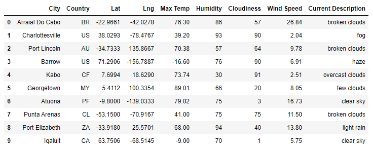
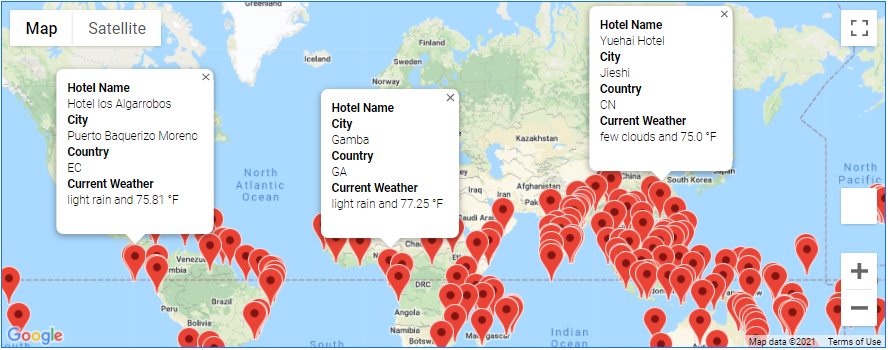
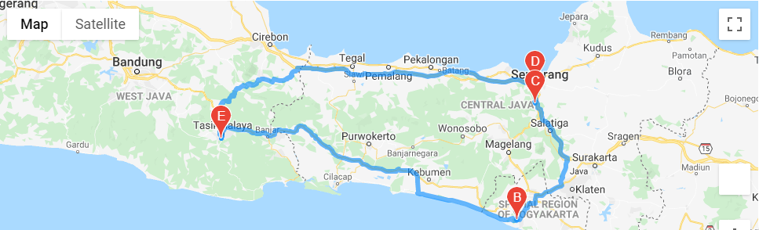
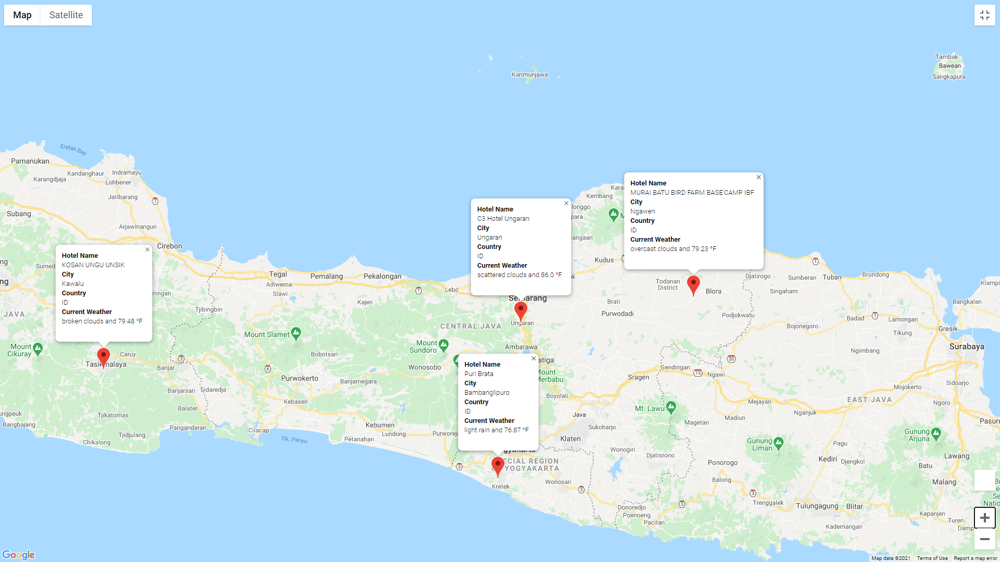

# World Weather Analysis: Using APIs to Visualize Weather Data

## Project Overview
PlanMyTrip is a top travel technology company specializing in internet-related services in the hotel and lodging industry. My supervisor, Jack, is the head of the User Interface Team, and so he has tasked me with helping to collect and present data for customers via the search page, which they will then filter on their preferred criteria in order to find their ideal hotel anywhere in the world. To perform this task, I've used a Jupyter Notebook in the citypy module to get the cities for more than 500 random latitudes and longitudes. Then, I performed requests on the OpenWeatherMap API and retrieved the JSON data from these cities. This weather data was added to a Pandas DataFrame where I used Matplotlib to create a series of scatter plots to show the relationship between latitude and a variety of weather parameters for over 500 cities around the world. As part of my analysis, I've performed statistical calculations on the data using linear regression on the weather parameters in the northern and southern hemispheres. This data will help my team predict the best time of year for people to plan their vacation. Finally, I have exported the data, cleaned it, and used the weather data to choose the best cities for a vacation based on certain weather criteria and then mapped these cities using Jupyter Gmaps and Google Places API.

## Resources
- **Data Sources**: cities.csv, WeatherPy_Database.csv & WeatherPy_vacation.csv
- **Software**: Python 3.7.6, Anaconda 4.9.2 & Git Bash 2.29.2
- **Tools**: Jupyter Notebook, Pandas, Matplotlib 3.3.2, NumPy library, SciPy library, OpenWeatherMap API, Google Maps, Google Places & Google Directions APIs 

## Challenge Overview
Jack loves the PlanMyTrip app. Beta testers love it too. And, as with any new product, they recommended a few changes to take the app to the next level. Specifically, they recommended adding the weather description to the weather data. Then, I added input statements for the beta testers to filter the data for their weather preferences, to be used to identify potential travel destinations and nearby hotels. From the list of potential travel destinations, the beta tester can now choose four cities to create a travel itinerary. Finally, using the Google Maps Directions API, I created a travel route between the four cities as well as a marker layer map.

## Challenge Deliverables

### Deliverable 1: Retrieve Weather Data
I generated a set of 2,000 random latitudes and longitudes, retrieved the nearest city, and performed an API call with the OpenWeatherMap. In addition to the city weather data, I used the API to retrieve the current weather description for each city. Then, I created a new DataFrame containing the updated weather data, as shown below.

### Deliverable 2: Deliverable 2: Create a Customer Travel Destinations Map
I used input statements to retrieve customer weather preferences, then used those preferences to identify potential travel destinations and nearby hotels. Then, I've shown those destinations on a marker layer map with pop-up markers, as shown below.

### Deliverable 3: Create a Travel Itinerary Map
I used the Google Directions API to create a travel itinerary that shows the route between four cities chosen from the customer’s possible travel destinations, as shown below.

Finally, I created a marker layer map with a pop-up marker for each city on the itinerary, as shwon below.

The PlanMyTrip app is now ready to help travelers find their ideal vacation spot and plan their trip!
